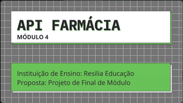

# <h1 align="center"> API - Farmácia ⚕️ </h1>

Projeto desenvolvido no curso de Desenvolvimento Web, Instituição de Ensino: Resilia Eduçação.
Sendo este proposto como projeto do Módulo 4 do curso.

# O Projeto 📋

A SQUAD 4 foi desafiada a desenvolver uma API com o produto mínimo viável de uma farmácia.

<p> 🦾 Nesse desafio, a nossa facilitadora tech, Karlla Souzza, solicitou que desenvolvessemos o conteúdo do módulo em equipe.
<p>
- DEMANDAS:
<p>✔️ Utilizar o padrão MVC;
<p>✔️ Utilizar os verbos HTTP seguindo o padrão REST;
<p>✔️ Implementar todas as operações de CRUD;
<p>✔️ Utilizar o padrão de projeto (design pattern) DAO para abstração de transações
no banco, com Promises;
<p>✔️ Utilizar o README.md do repositório para documentação.
<p>✔️ Utilização de async/await para operações no banco (DAO)
<p>✔️ Ter o código fonte hospedado em um repositório no Github.

<P> - ROTAS SOLICITADAS:
<P>● Listagem de todos os registros;
<P>● Listagem de um único registro com base em um parâmetro de rota;
<P>● Inserção de um registro;
<P>● Modificação de um registro;
<P>● Deleção de um registro.
  
# Instalção da Aplicação:
  <p>● Abra o terminal e executeos seguintes comandos:
  <p>
 - git clone https://github.com/JoaoLucasAl/API-Farmacia.git
  <p>
    ● Entre na pasta:
  <p>
 - cd API-Farmacia
  <p>
   ● Instale os pacotes:
  <p>
 - npm install
  <p>
   ● Crie e Popule o Banco de Dados:
  <p>
 - npm run database
    <p>
   ● Execute o Projeto:
      <p>
 - npm start
    
# Quais são as rotas possíveis:
## CLIENTES
Busca todos os clientes <br>
GET - http://localhost:8000/clientes

Busca cliente por ID <br>
GET - http://localhost:8000/clientes/:ID

Cadastro de um novo cliente <br>
POST - http://localhost:8000/clientes

```
BODY - JSON

{
	"NOME": "",
	"EMAIL":"",
	"TELEFONE": "",
	"CPF": ""
}
```

Deleção de um cliente<br>
DEL - http://localhost:8000/clientes/:ID

Alteração de um cliente<br>
PUT - http://localhost:8000/clientes/:ID

```
BODY - JSON

{
	"NOME": "",
	"EMAIL":"",
	"TELEFONE": "",
	"CPF": ""
}
```

#

## FUNCIONÁRIOS

Busca todos os funcionarios <br>
GET - http://localhost:8000/funcionarios

Busca funcionario por ID <br>
GET - http://localhost:8000/funcionarios/:ID

Cadastro de um novo cliente <br>
POST - http://localhost:8000/funcionarios

```
BODY - JSON

{
	"NOME": "",
	"EMAIL":"",
	"TELEFONE": "",
  "CARGO": "",
	"CPF": ""
}
```

Deleção de um funcionario<br>
DEL - http://localhost:8000/funcionarios/:ID

Alteração de um cliente<br>
PUT - http://localhost:8000/funcionarios/:ID

```
BODY - JSON

{
	"NOME": "",
	"EMAIL":"",
	"TELEFONE": "",
  "CARGO": "",
	"CPF": ""
}
```

#

## VENDAS

Busca todos as vendas <br>
GET - http://localhost:8000/vendas

Busca venda por ID <br>
GET - http://localhost:8000/vendas/:ID

Cadastro de uma nova venda <br>
POST - http://localhost:8000/vendas

```
BODY - JSON

{
  "REMEDIO_ID": "",
	"QUANTIDADE": ,
	"PRECO": ,
	"DESCONTO": ,
  "FUNCIONARIO_ID": "",
	"CLIENTE_ID": ""
}
```

Deleção de uma venda<br>
DEL - http://localhost:8000/vendas/:ID

Alteração de uma venda<br>
PUT - http://localhost:8000/vendas/:ID

```
BODY - JSON

{
  "REMEDIO_ID": "",
	"QUANTIDADE": ,
	"PRECO": ,
	"DESCONTO": ,
  "FUNCIONARIO_ID": "",
	"CLIENTE_ID": ""
}
```

# Status do Projeto 🚀

`Finalizado`

# Ferramentas Utilizadas ⚙️🛠️

- VISUAL STUDIO CODE
- GIT
- GIT HUB
- DISCORD
- GOOGLE PLANILHAS
- GOOGLE MEET
- CANVA
- SQLITE
- NOTION
- NODE JS
- INSOMNIA

# Nossa Equipe 👧🏾👦🏽👧🏾👦🏽

| [<br><sub>Isadora Sant'Ana</sub>](https://github.com/isadora30) | [<br><sub>João Lucas</sub>](https://github.com/JoaoLucasAl) | [<br><sub>Raíssa Dias</sub>](https://github.com/Jackiesants) | [<br><sub>Rio Ribeiro</sub>](https://github.com/rioribeirods) |
| :----------------------------------------------------------------------------------------------------------------------------------------: | :-----------------------------------------------------------------------------------------------------------------------------------: | :------------------------------------------------------------------------------------------------------------------------------------: | :--------------------------------------------------------------------------------------------------------------------------------------: |

# Conclusões 🎯

Logo, conseguimos desenvolver, além de todas as habilidades com as ferramentas e com conteúdo passado,

<p> harmonia e parceria no trabalho em equipe, bem como, a capacidade de aprender a aprender e de ajudar uns aos outros compartilhando conhecimentos.

Esperamos demonstrar nosso desenvolvimento enquanto aprendizes e contribuir como um bom exemplo de projeto!

<p>SQUAD 4.</p>


# SLIDE
[](https://www.canva.com/design/DAFJlsXs8So/xf40aUMV7vZOI4ZfNrkAeA/edit?utm_content=DAFJlsXs8So&utm_campaign=designshare&utm_medium=link2&utm_source=sharebutton)<br>
Clique para acessar o slide ☝️
